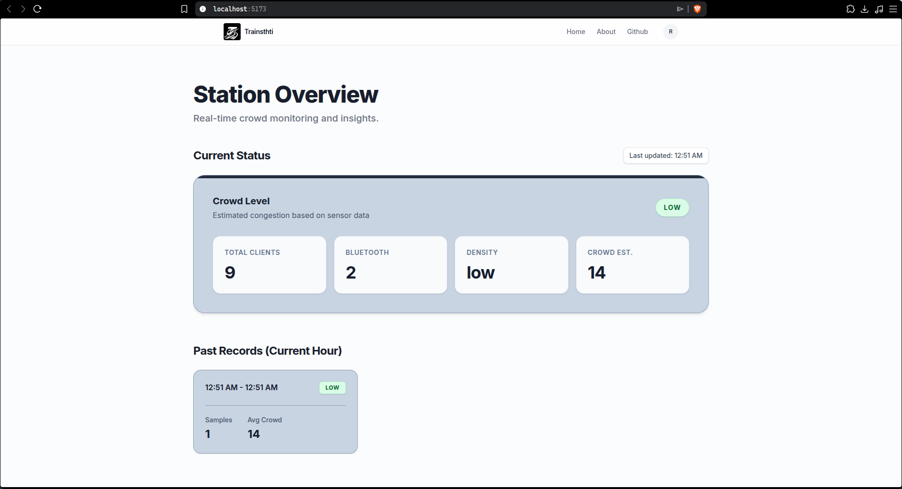
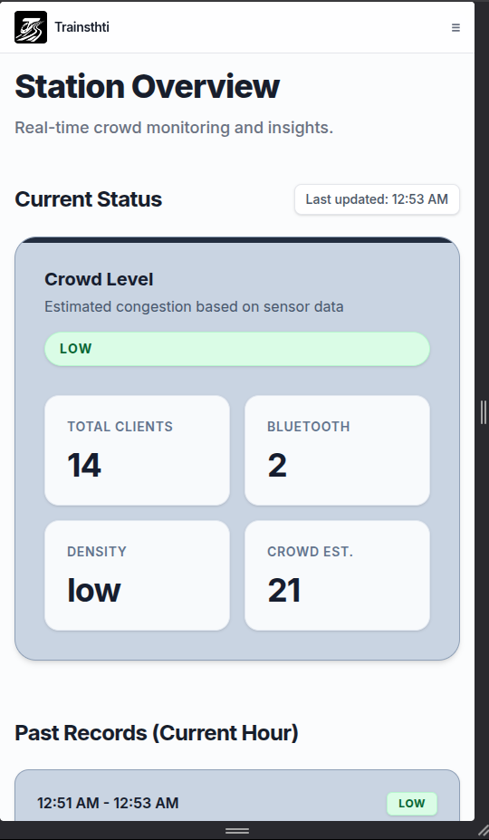
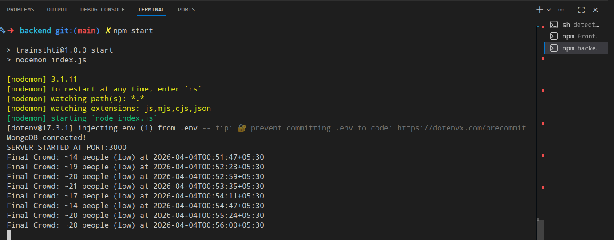

# TrainSthiti — Train Overcrowd Detector


> Second-year Computer Engineering project at **Don Bosco Institute of Technology, Mumbai**.

TrainSthiti is an IoT-inspired + web platform that estimates coach-level crowd density for suburban trains (inspired by Mumbai local use-cases) and exposes it in near real time.

The core idea is simple:

- an onboard edge node (Raspberry Pi class device) scans nearby Wi‑Fi/Bluetooth signals,
- raw counts are sent to a backend,
- the backend converts signals into crowd estimates and levels,
- the frontend continuously displays current and recent crowd trends.

For this academic prototype, the edge node is currently implemented with a **laptop-based Linux shell workflow** (instead of dedicated Raspberry Pi deployment) due to budget and scope constraints typical for a second-year project.

---

## Table of Contents

- [1) Problem Context](#1-problem-context)
- [2) Objectives](#2-objectives)
- [3) Scope and Assumptions](#3-scope-and-assumptions)
- [4) System Architecture](#4-system-architecture)
- [5) Repository Structure](#5-repository-structure)
- [6) Tech Stack](#6-tech-stack)
- [7) Crowd Estimation Logic](#7-crowd-estimation-logic)
- [8) API Reference](#8-api-reference)
- [9) Local Setup](#9-local-setup)
- [10) Runtime Behavior](#10-runtime-behavior)
- [11) Privacy and Security Considerations](#11-privacy-and-security-considerations)
- [12) Results (Prototype)](#12-results-prototype)
- [13) Screenshots](#13-screenshots)
- [14) Future Enhancements](#14-future-enhancements)
- [15) Team Pitch Summary](#15-team-pitch-summary)
- [16) License](#16-license)

---

## 1) Problem Context

Urban suburban rail systems carry very high commuter volumes, but passengers typically board without reliable information about coach crowding.

### Why this matters

- **Passenger safety risk**: overcrowded coaches increase accident and injury probability.
- **Poor travel experience**: uncertainty, stress, and discomfort during peak hours.
- **Operational blind spots**: no continuous coach-wise crowd telemetry for authorities.

### Existing-system gap

Current digital train tools generally provide schedules/platforms, not live coach crowd density. TrainSthiti addresses this exact gap with a low-cost sensing and analytics pipeline.

---

## 2) Objectives

- Build an automated crowd detection system using IoT scanning (no manual counting).
- Improve passenger decision-making with live coach density information.
- Support safer distribution of passengers across coaches.
- Provide a simple, understandable UI for real-time and short-window historical insights.
- Keep deployment practical and scalable for larger fleets.

---

## 3) Scope and Assumptions

### In-scope (current prototype)

- Device scanning via Wi‑Fi and Bluetooth (implemented via laptop-based Linux scripts in this version).
- Backend fusion logic to estimate crowd and classify `low` / `medium` / `high`.
- Storage of telemetry and periodic aggregation.
- Web dashboard with near-real-time updates.

### Prototype assumptions and limitations

- Estimation depends on discoverable radios (Wi‑Fi/Bluetooth state, scan visibility).
- Multipliers/weights are heuristic and require route/station-specific calibration.
- Environmental RF noise can affect counts.
- Current implementation is optimized for proof-of-concept behavior over production hardening.
- Raspberry Pi deployment is planned as a future hardware upgrade; current laptop-based edge execution was selected to stay within second-year academic budget and delivery scope.

---

## 4) System Architecture

TrainSthiti follows a modular, layered architecture:

1. **IoT Layer** (`detection/`)
   - Collects nearby device signals using shell-based scanning scripts.
2. **API/Processing Layer** (`backend/`)
   - Receives scan payloads, computes crowd estimates, stores telemetry, serves APIs.
3. **Database Layer** (MongoDB)
   - Persists crowd logs, grouped logs, and user records.
4. **Presentation Layer** (`frontend/`)
   - React dashboard polling backend endpoints for latest and quarter-hour data.

### Data flow (end-to-end)

1. `scan.sh` captures Wi‑Fi + Bluetooth observations.
2. Script builds JSON payload (`clients`, `bt_devices`, `density`, `timestamp`).
3. Payload POSTs to `POST /api/crowd`.
4. Backend computes weighted estimate and crowd label.
5. Frontend polls:
   - `GET /api/crowd/latest` (current state)
   - `GET /api/crowd/past` (quarter-hour aggregates for current hour)

---

## 5) Repository Structure

```text
trainsthiti/
├── backend/
│   ├── controllers/
│   │   ├── crowdController.js
│   │   └── userController.js
│   ├── routes/
│   │   ├── crowd.js
│   │   └── user.js
│   ├── db.js
│   ├── index.js
│   └── package.json
├── detection/
│   ├── scan.sh
│   └── infinite.sh
└── frontend/
    ├── src/
    │   ├── Context.jsx
    │   ├── App.jsx
    │   └── Components/
    ├── package.json
    └── ...
```

---

## 6) Tech Stack

### Hardware / Edge

- Linux laptop (current prototype edge implementation)
- Raspberry Pi class Linux device (target deployment hardware)
- Wi‑Fi + Bluetooth interfaces

### Backend

- Node.js + Express
- MongoDB (`mongodb` driver)
- `node-cron` for periodic grouping jobs
- `bcryptjs` for password hashing

### Frontend

- React (Vite)
- Tailwind CSS
- Axios

### Tooling

- Git/GitHub
- VS Code
- Postman/cURL for API testing

---

## 7) Crowd Estimation Logic

The backend currently fuses signal counts with weighted multipliers:

- `wifi_estimate = clients * 2`
- `bt_estimate = bt_devices * 3`
- `crowd_estimate = round(0.7 * wifi_estimate + 0.3 * bt_estimate)`

Crowd classification:

- `low` if estimate < 50
- `medium` if 50 <= estimate < 150
- `high` if estimate >= 150

> These values are prototype defaults and intended for field calibration.

---

## 8) API Reference

Base URL (default local): `http://localhost:3000`

### Crowd APIs

#### `POST /api/crowd`

Ingests a scan sample.

**Request body**

```json
{
  "clients": 42,
  "bt_devices": 13,
  "density": "medium",
  "timestamp": "2026-04-04T10:15:00+05:30"
}
```

**Response**

```json
{
  "status": "logged",
  "crowd_estimate": 79,
  "crowd_level": "medium"
}
```

#### `GET /api/crowd`

Returns a last-5-minutes grouped summary by crowd level.

#### `GET /api/crowd/latest`

Returns the most recent crowd log.

#### `GET /api/crowd/past`

Returns quarter-hour averages (`00-15`, `15-30`, `30-45`, `45-60`) for the current hour.

### User APIs

#### `POST /user/register`

Registers a user.

#### `POST /user/login`

Authenticates user credentials.

#### `GET /user`

Fetches user by username payload (as currently implemented).

---

## 9) Local Setup

## Prerequisites

- Node.js 18+
- MongoDB instance (local or cloud)
- Linux environment for scan scripts
- Tools for wireless scanning (`airmon-ng`, `airodump-ng`, `bluetoothctl`) and required permissions
- A Wi-Fi adapter/chipset that supports **monitor mode** (many default laptop adapters do not support this reliably on Linux)

### 1. Clone repository

```bash
git clone <your-repo-url>
cd trainsthiti
```

### 2. Backend setup

```bash
cd backend
npm install
```

Create `.env` in `backend/` (recommended: copy from `.env.example`):

```bash
cp .env.example .env
```

```env
DB_URI=<your-mongodb-connection-string>
```

Start backend:

```bash
npm start
```

Server default: `http://localhost:3000`

### 3. Frontend setup

```bash
cd ../frontend
npm install
npm run dev
```

Frontend default: `http://localhost:5173`

### 4. Detection script setup (Linux edge node)

From `detection/`:

```bash
chmod +x scan.sh infinite.sh
./scan.sh
# or continuous mode:
./infinite.sh
```

---

## 10) Runtime Behavior

- Frontend polls `/api/crowd/latest` every ~5s for live status.
- Frontend polls `/api/crowd/past` every ~5s for current-hour quarter summaries.
- Backend has an hourly cron trigger intended to move recent logs into grouped storage.

---

## 11) Privacy and Security Considerations

### Privacy model

- The system estimates crowd using detected device presence counts.
- No direct personal identity attributes are required for crowd classification.

### Security baseline

- Passwords are hashed on registration (`bcryptjs`).
- For production, add JWT/session hardening, rate limiting, input validation, and transport security (HTTPS).

---

## 12) Results (Prototype)

The integrated prototype demonstrates:

- successful capture of nearby wireless-device counts,
- backend estimation and crowd-level classification,
- near-real-time dashboard updates,
- short-window historical visibility (quarter-hour averages).

This validates technical feasibility and practical value for commuter guidance.

---

## 13) Screenshots

> Screenshots are stored in the `/screenshots` folder.

### Dashboard — Live Crowd Status



### Mobile View



### Backend / Detection Terminal



---

## 14) Future Enhancements

- Calibrate multipliers/weights using field datasets per line/time band.
- Add coach-wise identifiers and route metadata for richer analytics.
- Improve authentication/session model and role-based access.
- Add anomaly alerts for sudden crowd spikes.
- Introduce historical dashboards (daily/weekly trends, peak analysis).
- Harden edge ingestion with retries, offline buffering, and signed payloads.

---

## 15) Team Pitch Summary

TrainSthiti combines IoT sensing and modern web technologies to solve a real commuter pain point: uncertainty about coach crowding. It is low-cost, privacy-conscious, and architected for gradual scale-up from prototype to larger deployments.

---

## 16) License

License is currently not specified in this repository. Add a `LICENSE` file before public release.
